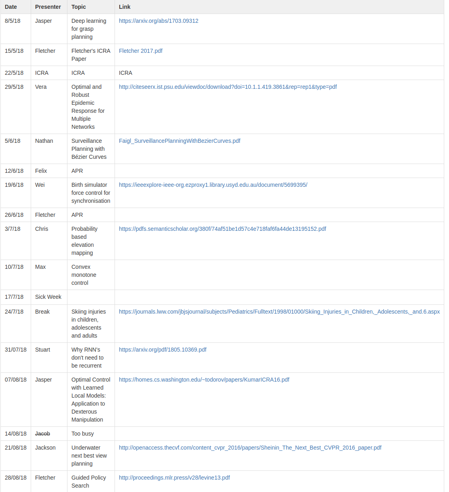

## The Lunch Reading Group

This page is to manage the ACFR lunch time reading group. 

The idea of the lunch reading group is to have a presenter explain an interesting or informative recent paper/technique while everyone eats lunch. It is modelled on the image reading group but is an informal chance to spend lunchtime finding out about a topic outside of your research area.

Meetings are held every **Tuesday from 12:30pm to 2pm** though we usually finish earlier, presentations should last 30-60 minutes with time for discussion included.

Previously, we went through a reinforcement learning tutorials set. The content followed David Silver's lectures at http://www0.cs.ucl.ac.uk/staff/d.silver/web/Teaching.html  
Also see  
-https://www.youtube.com/playlist?list=PLqYmG7hTraZDM-OYHWgPebj2MfCFzFObQ  
-https://medium.com/biffures/rl-course-by-david-silver-lectures-1-to-4-7667608bf7d3  

Fletcher's solution to the Easy21 assignment is [this file](files/easy21.py)

A good blog post for an overview of actor critic methods (and the A2C algorithm) is  
-https://hackernoon.com/intuitive-rl-intro-to-advantage-actor-critic-a2c-4ff545978752 

## Guidelines
-Upload the paper or presentation at least 1 day prior  
-It's informal, so present however you feel is most useful. Presenting should not be a significant burden, providing a clear overview of the work, along with contributions and limitations is more important than having nice slides  
-Pick any recent paper you have found interesting or useful which other people are unlikely to have read  
-Lunch appropriate illustrations please (looking at you Wei Rong)  

## 2019 Schedule
The current schedule

| Date  | Presenter | Topic | Link |
| ------------- | ------------- | ------------- | ------------- |
| 22/1/19 | Jasper | Adaptive nodes enrich nonlinear cooperative learning beyond traditional adaptation by links (Dendritic Learning In Humans) | https://www.nature.com/articles/s41598-018-23471-7 |
| 29/1/19 | ~~Jacob~~ | _ | _ |
| 5/2/19 | Vera | ICRA Paper | [Vera ICRA Paper](files/Vera_ICRA_v1.pdf) |
| 12/2/19 | Johnny | Learning by Observation for Surgical Tasks | [Learning by Observation for Surgical Tasks](files/DaVinciICRA2015.pdf),  [Slides](files/JohnnySlidesFeb.pdf) |
| 19/2/19 | Fletcher | Learning Control from Raw Images | [Embed to Control; Control from raw images](http://papers.nips.cc/paper/5964-embed-to-control-a-locally-linear-latent-dynamics-model-for-control-from-raw-images.pdf?fbclid=IwAR2SbC_nI3CFBRt6q54uef1opjgSi8UDlt5pULv9rKZQNmCUXY1AZ9tS6Qk) |
| 26/2/19 | Max | Journal Paper | Ask Him |
| 5/3/19 | Jacob | Bayesian Hilbert Maps for Dynamic Continuous Occupancy Mapping | http://proceedings.mlr.press/v78/senanayake17a/senanayake17a.pdf |
| 12/3/19 | Jackson | Using cGANs to predict ground views from satellite imagery | https://arxiv.org/pdf/1806.05129.pdf |
| 19/3/19 | Jasper | Semi Supervised Depth Prediction | https://arxiv.org/pdf/1702.02706.pdf |
| 26/3/19 | Johnny | Force Control of Flexible Integrated Joint Based on Model-free Adaptive Control | [Here](files/Model Free Joint Force Control.pdf) |
| 2/4/19 | Vera | _ | _ |
| 9/4/19 | Fletcher | _ | _ |
| 16/4/19 | Wei? | _ | _ |
| 23/4/19 | Max | _ | _ |
| 30/4/19 | James? | _ | _ |
| 7/5/19 | Jackson | _ | _ |
| 14/5/19 | Jacob | _ | _ |
| 21/5/19 | _ | _ | _ |
| 28/5/19 | _ | _ | _ |

## Past Schedules
The pre 2019 schedules

| Date  | Presenter | Topic | Link |
| ------------- | ------------- | ------------- | ------------- |
| 4/9/18 | Jasper | RL1 | Intro http://www0.cs.ucl.ac.uk/staff/d.silver/web/Teaching.html |
| 11/9/18 | Fletcher | RL2 | MDPs |
| 18/9/18 | _ | _ | _ |
| 25/9/18 | _ | _ | _ |
| 2/10/18 | Max | RL3 | Dynamic Programming |
| 9/10/18 | Jackson | RL4 | Model Free Prediction |
| 16/10/18 | Vera | RL5 | Modle Free Control (End of part 1, reassess schedule)| 
| 23/10/18 | Jasper/Fletcher/All | Recap Lecture | Examples + Summary |
| 30/10/18 | Johnny | RL6 | Value Function Approximation |
| 6/11/18 | _ | _ | _ |
| 13/11/18 | Fletcher | Atari article | https://www.nature.com/articles/nature14236.pdf |
| 20/11/18 | Wei | RL7 | Policy Gradient Methods |
| 27/11/18 | James | RL8 | Integrating Learning and Planning |
| 4/12/18 | Max | RL9 | Exploration and Exploitation |
| 11/12/18 | Jasper | World Models | https://arxiv.org/pdf/1803.10122.pdf |
| 18/12/18 | _ | _ | _ |
| 25/12/18 | Go home | to | your families |

